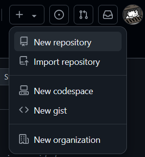

# Introduzione a GitHub (https://github.com)

GitHub è un servizio di hosting per repository Git che permette a più programmatori di lavorare su uno stesso progetto in maniera facile e veloce. Grazie a questo. è particolarmente utilizzato per progetti open source.

---
### Crea nuova repository

Come detto prima, GitHub permette la creazione di repository Git in cloud.
Per creare una repository, basta fare il login nell'app, e poi cliccare su + -> New repository:

- Owner: Chi possiede la repository (di default è l'user correntemente loggato);
- Repository name: Il nome che si vuole dare alla nuova repository;
- Description: La descrizione della repo;
- Public/Private: La visibilità della repo (se tutti possono vederla o solo a chi viene permesso;
- Add a README file: Crea un commit di base con un file README in markdown;
- Add .gitignore: Aggiunge un file che permette di ignorare alcuni file nei commit;
- Choose a license: Sceglie una licenza per il contenuto della repo;

Dopo aver inserito tutti i dati necessari, basta cliccare Create Repository per creare la repo.

Prossimo: [La repository in GitHub e le sue funzionalità](./2_Repository.md)