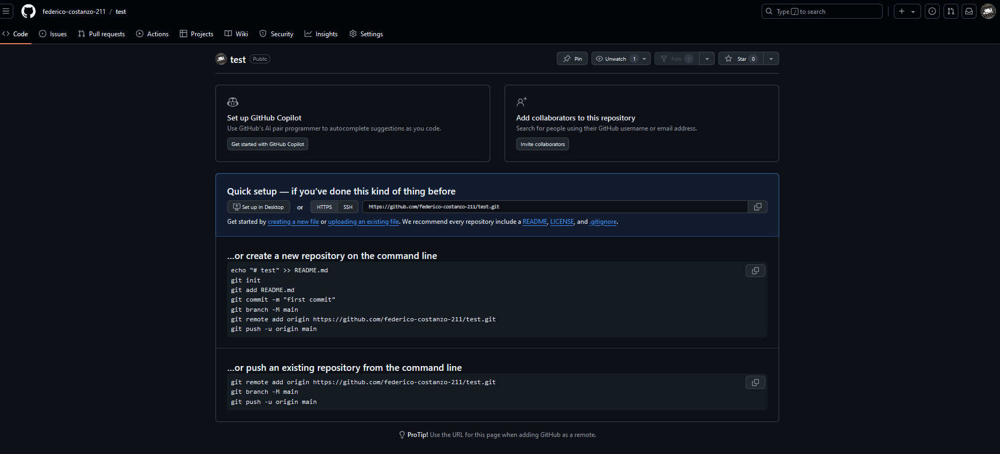

# La repository in GitHub

Dopo aver creato la repository, si viene portati nella pagina della repo: 

Da qui si può già portare la repository in locale e fare le modifiche volute.
Tra le funzionalità disponibili abbiamo in particolare:
- Issues, un sistema di ticket che permette di tracciare cose da fare, bug nel programma, richieste di feature, etc.

- Pull Requests, che sono richieste da parte di altri sviluppatori (o anche tue) di introdurre cambiamenti nel codice della repository. Da qui si possono vedere i cambiamenti dei file e poi eventualmente accettarli o rifiutarli.

- Actions, che permette di modificare come la repository agisce e quindi automatizzare il processo.

- Projects, una taskboard e roadmap che si sincronizza con le issues e le pull requests.

- Wiki, per creare una documentazione per il codice direttamente dal sito.

- Security, per modificare come la repo verifica se ci sono vulnerabilità nel codice.

- Insights, una pagina che mostra tutti i dati inerenti alla repository (Pull requests fatte, pull requests accettate, etc.)

- Settings, altre impostazioni.

---

Per altre repository che non possiedi, in particolare, è possibile creare una fork della repository, cioè creare una copia modificabile della repository e la aggiunge al tuo account, il cui permette di creare multiple varianti di un software.